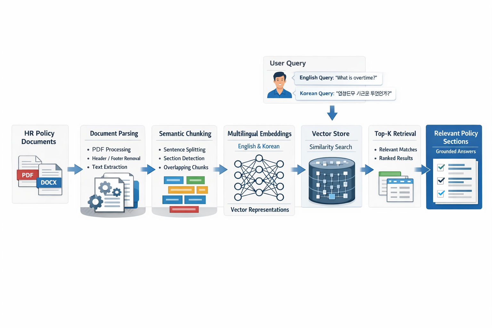
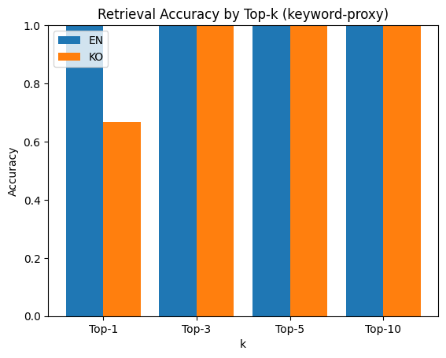
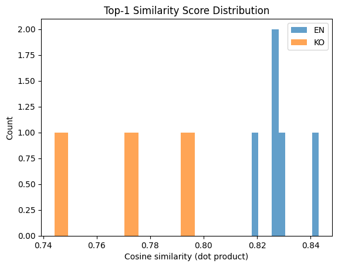
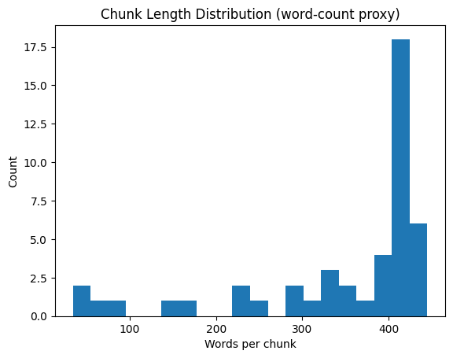
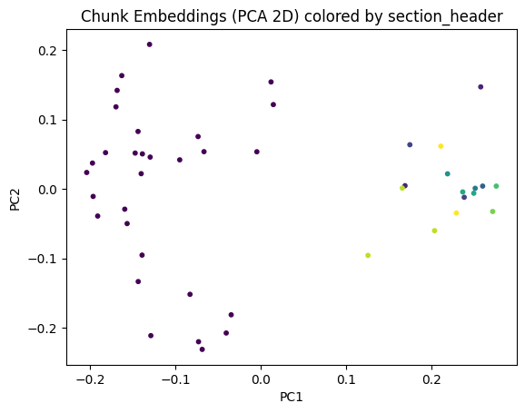

# Multilingual Internal Policy Assistant (RAG System)

A production-oriented **multilingual Retrieval-Augmented Generation (RAG)** system for querying internal company policy documents (HR, leave, overtime, compliance) in **English and Korean**.

This project emphasizes **robust document ingestion, semantic retrieval, evaluation, and visualization**, rather than a simple chatbot demo.

---

## 🔍 Problem Statement

Employees frequently ask repetitive questions about:
- overtime rules
- vacation / annual leave
- sick leave
- working hours
- policy compliance

These questions are:
- time-consuming for HR teams
- error-prone when answered manually
- difficult for multilingual organizations

---

## 💡 Solution

A **document-grounded multilingual RAG pipeline** that:
- ingests real company policy PDFs
- retrieves relevant policy sections using embeddings
- supports English and Korean queries
- avoids hallucinations by answering strictly from documents

---

## 🧠 System Architecture

---

## ⚙️ Key Features

- 📄 **Robust PDF parsing**
  - header/footer filtering
  - block-level text ordering
- ✂️ **Semantic + section-aware chunking**
  - sentence-safe splitting
  - overlap handling
- 🌍 **Multilingual retrieval (EN / KR)**
  - single embedding model (no translation)
- 📊 **Evaluation & validation**
  - Top-k accuracy
  - Mean Reciprocal Rank (MRR)
- 📈 **Visual analysis**
  - retrieval score distributions
  - chunk statistics
  - embedding space visualization

---

## 📦 Tech Stack

- **Language**: Python
- **Document Parsing**: PyMuPDF, python-docx
- **Chunking**: Custom semantic + section-aware logic
- **Embeddings**: `intfloat/multilingual-e5-large`
- **Similarity Search**: cosine similarity
- **Evaluation**: Top-k accuracy, MRR
- **Visualization**: matplotlib, NumPy
- **Environment**: Jupyter / Google Colab

---

The following visualizations were generated to **validate retrieval quality, chunking strategy, and embedding behavior**.

> 📁 *All figures are stored in the project repository (e.g., `/figures` or `/assets`).*

---

### 🔹 Retrieval Accuracy (Top-K)

*Shows Top-1 / Top-3 / Top-5 accuracy for English and Korean queries.*

---

### 🔹 Similarity Score Distribution

*Distribution of cosine similarity scores for retrieved results, illustrating separation between relevant and less relevant chunks.*

---

### 🔹 Chunk Length Distribution

*Validates that chunk sizes remain within the intended range and preserve semantic context.*

---

### 🔹 Embedding Space Visualization (2D)

*2D projection (PCA/UMAP) of document chunk embeddings, colored by policy section, demonstrating semantic clustering.*

---

## 🧪 Example Queries

**English**
- “What is considered overtime?”
- “How many weeks of vacation do employees get after one year?”
- “Is overtime paid or compensated with time off?”

**Korean**
- “연장근무 기준은 무엇인가요?”
- “휴가는 1년 근무 후 얼마나 받을 수 있나요?”
- “병가는 언제 진단서가 필요하나요?”

---

## 🚀 Future Improvements

- FastAPI service for production deployment
- Cross-encoder reranking for higher retrieval precision
- LLM-based answer generation with citations
- Web or Slack-based user interface

---

## 📌 Disclaimer

The policy document used is a **public HR policy template** for demonstration purposes only.  
No proprietary or confidential company data is included.

---

## 👤 Author

**Akbarjon Matrasulov**  
AI / Computer Vision / NLP Engineer
